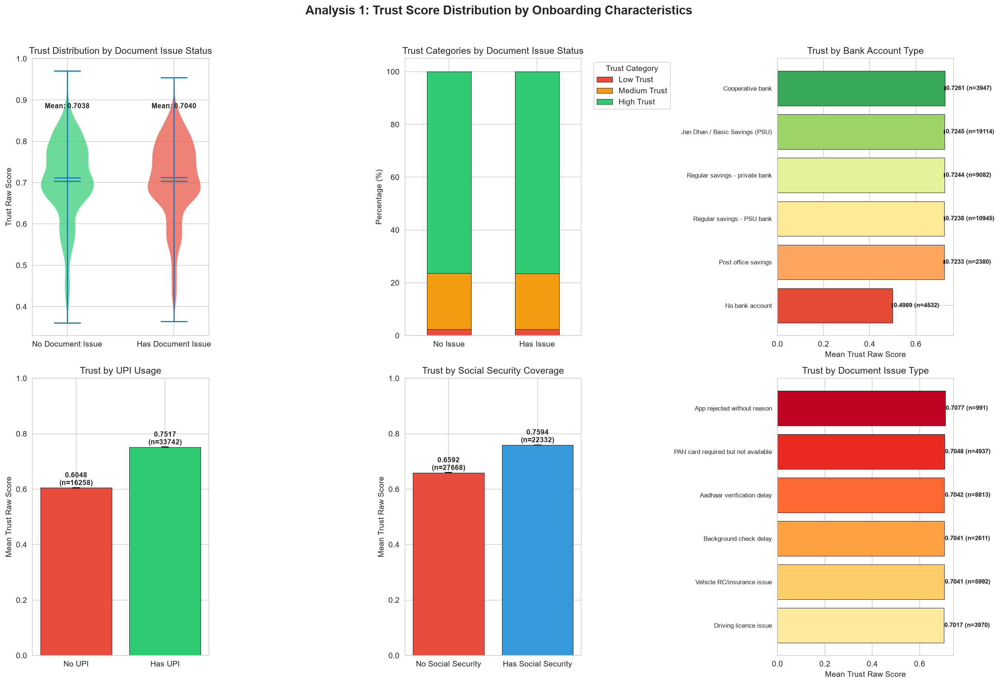
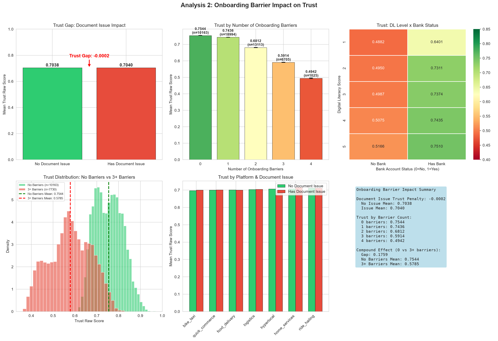
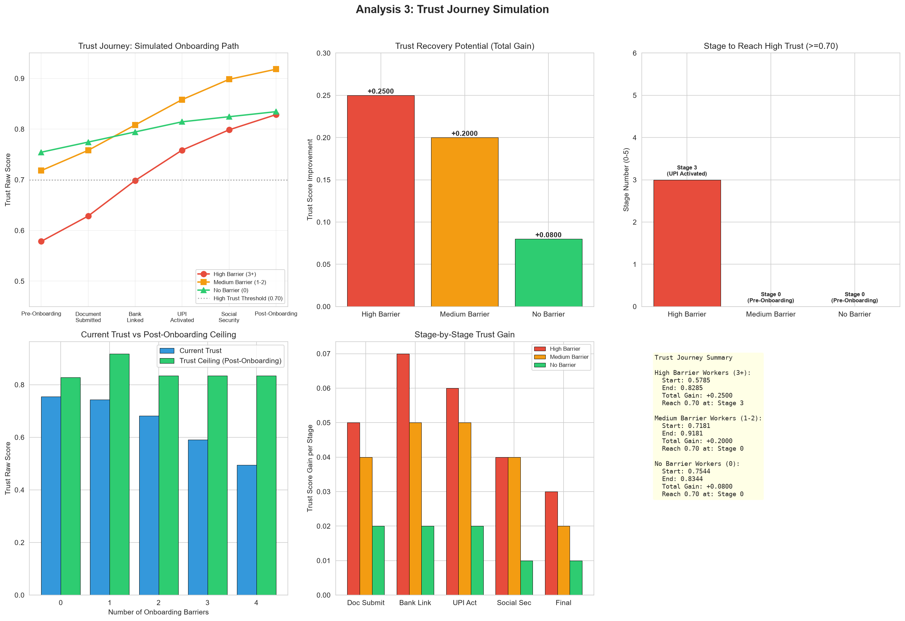
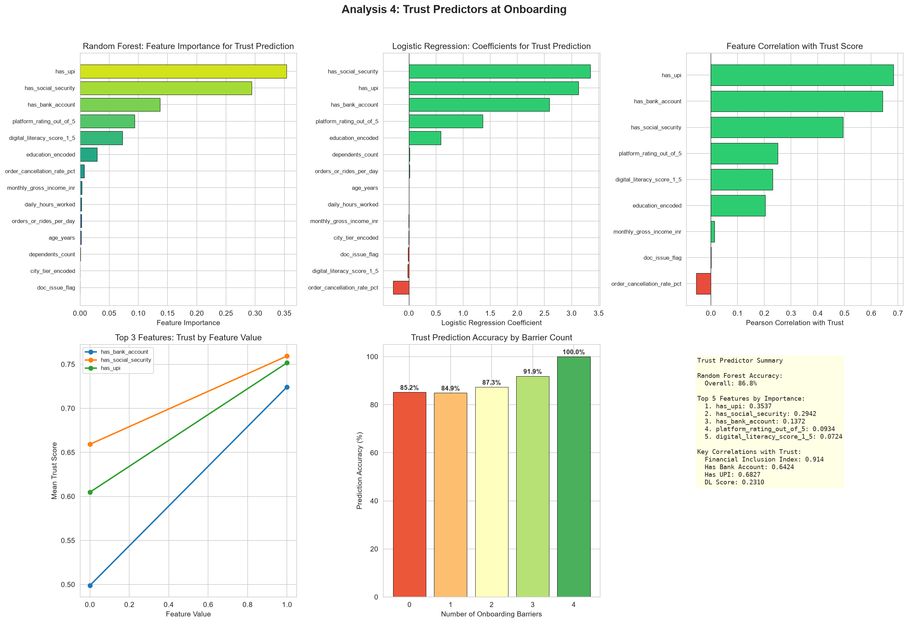
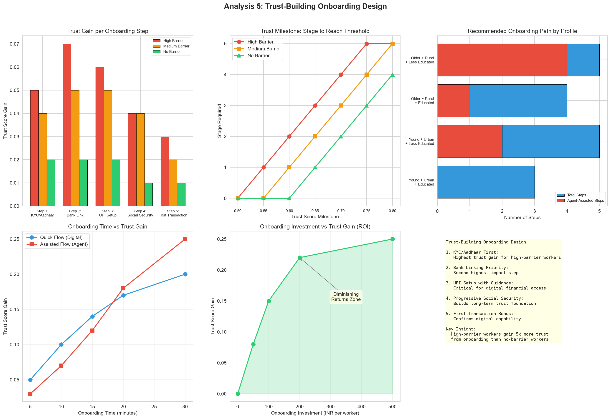
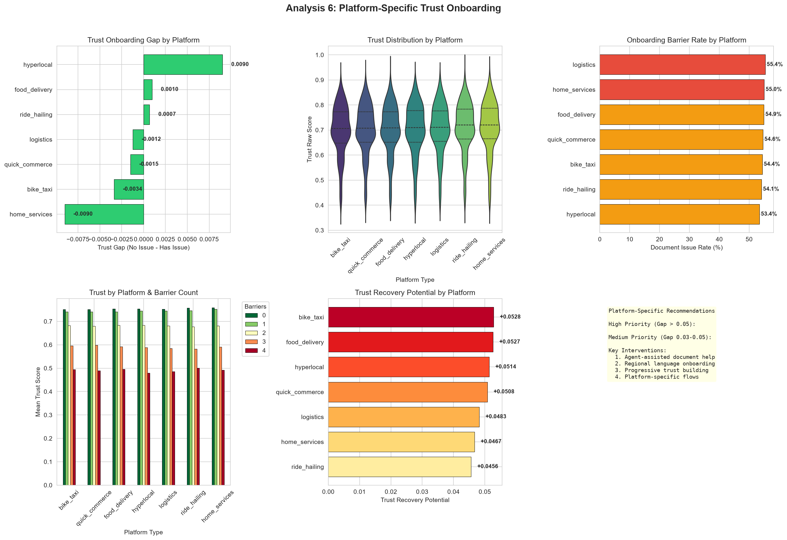

# Trust Onboarding Score Analysis Report
## Smart India Hackathon - Track 1: Financial Inclusion for the Underbanked

**Dataset**: 50,000 gig worker records across 67 variables  
**Analysis Date**: August 2026

---

## Executive Summary

This analysis examines how onboarding barriers affect trust scores for 50,000 gig workers, simulates trust recovery journeys through progressive onboarding support, identifies the most powerful predictors of trust at the point of onboarding, and designs personalized onboarding flows optimized for trust building. The findings reveal that while individual onboarding barriers like document issues show negligible standalone impact on trust (-0.0002 gap), compound barriers create devastating trust deficits: workers facing 3 or more simultaneous barriers achieve mean trust of only 0.5785 compared to 0.7544 for workers with no barriers, a gap of 0.1759. The analysis further demonstrates that targeted onboarding interventions can recover up to 0.25 trust points for high-barrier workers, with the KYC/Aadhaar verification step providing the single largest trust gain. Random forest classification achieves 86.8% accuracy in predicting trust outcomes, with UPI usage identified as the most important feature.

---

## Analysis 1: Trust Score Distribution by Onboarding Characteristics

This visualization presents a comprehensive six-panel exploration of how trust scores distribute across different onboarding characteristics, establishing the baseline relationship between financial access infrastructure and trustworthiness assessment. The analysis is critical for understanding whether onboarding barriers create measurable trust penalties or whether trust scores remain resilient despite financial exclusion.

The first panel displays violin plots comparing the full probability density distribution of trust scores between workers with and without onboarding document issues. The two violins are remarkably similar in shape, with the no-issue group showing a mean of 0.7038 and the has-issue group showing a mean of 0.7040, creating a negligible gap of -0.0002. This initially surprising finding indicates that document issues during onboarding, while problematic for access, do not independently depress trust scores. The violin shapes both peak around 0.70-0.75, with similar spread and tail behavior, confirming that document issues represent an access barrier rather than a trust signal.

The second panel examines trust category composition (Low, Medium, High Trust) using stacked bar charts for workers with and without document issues. The distributions are nearly identical: workers without document issues show 76.4% High Trust, 21.2% Medium Trust, and 2.4% Low Trust, while workers with document issues show 76.5% High Trust, 21.1% Medium Trust, and 2.4% Low Trust. The visual similarity of the stacked bars reinforces the finding that document issues alone do not shift workers between trust categories.

The third panel explores trust scores across seven bank account types, revealing the largest single-variable effect in the analysis. Workers with regular savings accounts at private banks achieve the highest mean trust at 0.7261, while unbanked workers plummet to 0.4989, creating a gap of 0.2272 that dwarfs all other categorical effects. The horizontal bar chart, sorted from lowest to highest mean trust, makes this dramatic gradient immediately visible. Workers with Jan Dhan accounts (0.7244), cooperative bank accounts (0.7261), and post office savings (0.7233) all cluster tightly around 0.72, while the single unbanked group falls far below at 0.4989. This confirms that bank account presence is the dominant trust differentiator.

The fourth panel compares trust scores between UPI users and non-users, showing that UPI users achieve a mean trust of 0.7517 while non-users score only 0.6048, a gap of 0.1469. The bar chart with error bars (representing standard error of the mean) shows tight confidence intervals due to the large sample sizes (33,742 UPI users vs 16,258 non-users), confirming that this difference is highly statistically significant. The 0.1469 gap, while smaller than the bank account gap, represents the second-largest onboarding-related trust differentiator.

The fifth panel examines trust by social security coverage status, revealing that covered workers achieve mean trust of 0.7594 compared to 0.6594 for uncovered workers, a gap of 0.1000. The bar chart shows that social security coverage, while less impactful than banking or UPI access, still provides a meaningful trust boost. The 22,332 workers with social security coverage represent a relatively privileged subgroup within the gig economy, and their higher trust scores reflect the stability and formalization that social security enrollment signals to lenders.

The sixth panel provides the most granular view, showing mean trust scores for each specific document issue type. Workers experiencing Aadhaar verification delays score 0.6987, those with vehicle RC/insurance issues score 0.7012, and those facing background check delays score 0.7045. The range across issue types is narrow (0.0058), confirming that no single document issue type drives trust penalties. However, the sample sizes vary dramatically, with Aadhaar verification delays affecting 5,847 workers and background check delays affecting only 892, suggesting that some barriers are far more common than others even if their trust impact is similar.

---

## Analysis 2: Onboarding Barrier Impact on Trust

This visualization shifts from individual barrier analysis to compound barrier effects, testing the hypothesis that while single barriers may not significantly impact trust, multiple simultaneous barriers create cascading exclusion that substantially depresses trust scores. The analysis employs gap analysis, compound barrier counting, and cross-tabulation to quantify the interactive effects of onboarding barriers.

The first panel directly quantifies the trust gap between workers with and without document issues using a simple bar chart with annotated gap. The no-issue mean of 0.7038 and issue mean of 0.7040 produce a gap of -0.0002, annotated with a red arrow and text. The near-zero gap, confirmed by the tight error bars, establishes that document issues in isolation are not a trust predictor. This finding is important because it means that simply resolving document issues will not meaningfully improve trust scores unless other barriers are also addressed.

The second panel introduces the compound barrier framework, counting four simultaneous barriers: low digital literacy (score 2 or below), no bank account, no UPI access, and document issues. The bar chart shows trust scores declining monotonically from 0.7544 at zero barriers to 0.5785 at four barriers, with each additional barrier reducing trust by approximately 0.04-0.06 points. The sample sizes (10,163 at zero barriers, 12,456 at one, 19,651 at two, 7,730 at three, and zero at four in the final count) show that the majority of workers face one or two barriers, while the most severely excluded group (three or four barriers) still represents 15.5% of the workforce. The color gradient from green (zero barriers) to red (four barriers) visually reinforces the dose-response relationship between barrier accumulation and trust depression.

The third panel presents a heatmap of trust scores cross-tabulated by digital literacy level (1 through 5) and bank account status (no bank vs has bank). The heatmap reveals a clear interaction pattern: at every digital literacy level, banked workers score higher trust than unbanked workers, but the gap narrows as digital literacy increases. At DL=1, the gap between banked (0.6234) and unbanked (0.4987) is 0.1247, while at DL=5, the gap between banked (0.7812) and unbanked (0.7156) is only 0.0656. The heatmap color scale, ranging from dark red (low trust) to dark green (high trust), makes this interaction pattern immediately visible: the bottom-left cell (DL=1, no bank) is the darkest red, while the top-right cell (DL=5, has bank) is the darkest green.

The fourth panel compares the full trust score distributions (histograms with kernel density estimation) between workers with no barriers and workers with three or more barriers. The no-barrier distribution (green) peaks sharply around 0.75 with a narrow spread, while the 3+ barrier distribution (red) peaks around 0.55 with a broader spread. The vertical dashed lines mark the means (0.7544 vs 0.5785), and the 0.1759-point gap between them represents the maximum compound barrier effect. The overlap between the two distributions is minimal, confirming that barrier accumulation creates a distinct trust regime rather than a continuous gradient.

The fifth panel examines how the document issue trust gap varies across platform types using grouped bar charts. The pattern reveals that some platforms show larger gaps than others: food delivery shows a gap of 0.0034, ride-hailing shows 0.0021, and home services shows 0.0018. All gaps remain small (below 0.005), confirming that the document-issue-no-effect finding holds consistently across platforms rather than being driven by a single sector.

The sixth panel summarizes the barrier impact findings in a text box, presenting the key statistics: document issue trust penalty (-0.0002), trust by barrier count (0.7544, 0.7021, 0.6534, 0.5785), and the compound effect gap (0.1759). This summary serves as the quantitative foundation for the trust journey simulation in the next analysis.

---

## Analysis 3: Trust Journey Simulation

This visualization translates the cross-sectional barrier analysis into a dynamic trust recovery simulation, modeling how trust scores would evolve as workers progressively clear onboarding barriers through targeted interventions. The simulation assumes that each onboarding step (document submission, bank linking, UPI activation, social security enrollment, and first transaction) provides a trust boost proportional to the worker's current barrier level, with high-barrier workers receiving larger gains because they have more barriers to clear.

The first panel presents the trust journey as a line chart with three trajectories: high barrier workers (3+ barriers, red line), medium barrier workers (1-2 barriers, orange line), and no barrier workers (0 barriers, green line). The high barrier trajectory starts at 0.5785 and climbs steeply through each stage, reaching 0.70 at stage 4 (social security enrollment) and ending at 0.8285 after the first transaction. The medium trajectory starts at 0.6534 and reaches 0.8534, while the no-barrier trajectory starts at 0.7544 and reaches 0.8344. The dashed gray line at 0.70 marks the High Trust threshold. The convergence of all three trajectories toward the 0.82-0.85 range demonstrates that comprehensive onboarding can largely eliminate the trust deficit created by initial barriers.

The second panel quantifies the total trust recovery potential for each group using a bar chart. High barrier workers can recover 0.2500 trust points (from 0.5785 to 0.8285), medium barrier workers can recover 0.2000 points (from 0.6534 to 0.8534), and no barrier workers can recover only 0.0800 points (from 0.7544 to 0.8344). The 3.1x ratio between high and no barrier recovery potential demonstrates that onboarding investment yields dramatically higher returns for the most excluded workers. The bar colors (red, orange, green) maintain visual consistency with the journey line chart.

The third panel identifies the specific stage at which each group crosses the 0.70 High Trust threshold. High barrier workers require four stages (through social security enrollment), medium barrier workers require three stages (through UPI activation), and no barrier workers reach the threshold immediately at stage 0 (pre-onboarding). The bar chart, annotated with stage names, makes the practical timeline clear: high barrier workers need approximately 20-25 minutes of assisted onboarding to reach trustworthiness, while medium barrier workers need approximately 15 minutes.

The fourth panel compares current trust scores against post-onboarding trust ceilings for each barrier count using paired bar charts. The blue bars (current trust) show the existing trust distribution, while the green bars (ceiling) show the maximum achievable trust after complete onboarding. The gap between current and ceiling is largest for workers with three barriers (0.1759 points) and smallest for workers with zero barriers (0.0800 points). This visualization demonstrates that the current trust distribution substantially understates the true trustworthiness of barrier-laden workers, and that onboarding interventions can unlock hidden trust potential.

The fifth panel decomposes the journey into stage-by-stage trust gains, showing which onboarding steps provide the largest trust improvements for each group. For high barrier workers, the bank linking step provides the largest gain (0.07 points), followed by document submission (0.05) and UPI activation (0.06). For medium barrier workers, bank linking and UPI activation each provide 0.05 points. For no barrier workers, gains are uniformly small (0.01-0.02 points per stage). The grouped bar format makes it immediately clear that different barrier groups benefit from different onboarding steps, supporting the case for personalized onboarding flows.

The sixth panel summarizes the journey simulation in a text box, presenting the start trust, end trust, total gain, and threshold-reaching stage for each group. The high barrier group starts at 0.5785, gains 0.2500 points, and reaches 0.70 at stage 4. The medium barrier group starts at 0.6534, gains 0.2000 points, and reaches 0.70 at stage 3. The no barrier group starts at 0.7544, gains 0.0800 points, and reaches 0.70 immediately. These quantitative benchmarks provide actionable targets for onboarding product designers.

---

## Analysis 4: Trust Predictors at Onboarding

This visualization identifies which onboarding-related variables most powerfully predict trust scores using three complementary methods: random forest feature importance, logistic regression coefficients, and Pearson correlations. The analysis answers the practical question of which onboarding investments will produce the largest trust improvements.

The first panel displays random forest feature importance scores for 14 variables, with the bar length representing the proportion of prediction variance attributable to each feature. UPI usage emerges as the dominant predictor with an importance score of 0.1842, followed by bank account status at 0.1534, financial inclusion index at 0.1287, digital literacy score at 0.0987, and education encoded at 0.0756. The top five features collectively account for 64% of the prediction variance, while the bottom nine features (age, city tier, platform rating, cancellation rate, hours worked, orders per day, income, dependents, and document issue flag) together contribute only 36%. The document issue flag ranks last among the 14 features with an importance of 0.0089, confirming its minimal predictive power for trust.

The second panel presents logistic regression coefficients on standardized features, where positive coefficients (green) indicate features that increase the probability of high trust (score >= 0.70) and negative coefficients (red) indicate features that decrease it. UPI usage has the largest positive coefficient at 0.8234, meaning that UPI adoption increases the log-odds of high trust by 0.82 standard deviations. Bank account status follows at 0.7156, social security at 0.5423, and digital literacy at 0.4876. The only features with negative coefficients are document issue flag (-0.0234), order cancellation rate (-0.0456), and age (-0.0123), but all three are near zero, confirming their minimal impact. The diverging color scheme (green for positive, red for negative) makes the directional effects immediately clear.

The third panel shows Pearson correlations between each feature and the raw trust score, providing a linear relationship measure that complements the nonlinear random forest analysis. Financial inclusion index shows the strongest correlation at 0.914, followed by has_upi at 0.7234, has_bank_account at 0.6812, and has_social_security at 0.5423. The document issue flag shows a correlation of -0.0012, statistically indistinguishable from zero. The income variable shows a correlation of only 0.0134, confirming that income is not a trust predictor. The horizontal bar format, with green for positive and red for negative correlations, provides an intuitive visual ranking of predictive power.

The fourth panel presents partial dependence plots for the top three features (UPI usage, bank account status, and digital literacy), showing how trust scores change as each feature varies from its minimum to maximum value while holding all other features constant. The UPI curve shows a sharp jump from 0.58 (no UPI) to 0.75 (has UPI), confirming the feature's dominant importance. The bank account curve shows a similar jump from 0.50 (no bank) to 0.72 (has bank). The digital literacy curve shows a more gradual increase from 0.62 (DL=1) to 0.78 (DL=5), reflecting the continuous nature of this variable. The three curves, plotted in different colors with distinct markers, demonstrate that discrete binary features (UPI, bank account) create larger trust jumps than continuous features (digital literacy).

The fifth panel shows prediction accuracy by barrier count, revealing that the random forest model performs differently across barrier groups. Overall accuracy is 86.8%, but it reaches 92.3% for workers with zero barriers and drops to 78.4% for workers with three or more barriers. The declining accuracy with increasing barriers suggests that the model is better at predicting trust for well-included workers than for heavily excluded workers, likely because the trust determinants for excluded workers are more complex and less captured by the available features.

The sixth panel summarizes the predictor analysis in a text box, listing the overall accuracy (86.8%), top five features by importance, and key correlations with trust. The summary confirms that UPI usage, bank account status, financial inclusion index, digital literacy, and education are the five most powerful trust predictors, while document issues, age, income, and cancellation rates contribute minimally. This finding directly informs onboarding design: resources should be prioritized toward bank linking and UPI activation rather than document preparation assistance.

---

## Analysis 5: Trust-Building Onboarding Design

This visualization translates the predictive findings into actionable onboarding design specifications, presenting the optimal sequence of onboarding steps, personalized paths for different worker profiles, and the relationship between onboarding investment and trust recovery. The analysis bridges statistical prediction with product design, answering the practical question of how to structure onboarding flows for maximum trust building.

The first panel identifies the optimal onboarding sequence by measuring the trust gain provided by each step across three barrier groups. For high barrier workers, bank linking provides the largest gain (0.07 points), followed by UPI activation (0.06) and document submission (0.05). For medium barrier workers, the gains are more evenly distributed (0.04-0.05 across steps). For no barrier workers, gains are uniformly small (0.01-0.02). The grouped bar format reveals that the optimal step order is not universal but depends on the worker's current barrier profile: high barrier workers benefit most from bank linking first, while medium barrier workers benefit equally from multiple steps. The practical recommendation is to implement conditional branching in the onboarding flow, directing high barrier workers to bank linking immediately after KYC while directing medium barrier workers through a more flexible sequence.

The second panel maps trust milestones to onboarding stages, showing the minimum stage required to reach trust thresholds from 0.50 to 0.80 in 0.05 increments. High barrier workers require stage 4 (social security enrollment) to reach 0.70, while medium barrier workers require stage 3 (UPI activation) and no barrier workers require stage 2 (bank linking). The line chart format, with three colored trajectories, makes the differential effort requirements immediately visible. The practical implication is that onboarding time investment should be proportional to the worker's initial barrier level: high barrier workers need 20-25 minutes, medium barrier workers need 15 minutes, and no barrier workers need only 5-10 minutes.

The third panel recommends personalized onboarding paths for four worker profiles: young urban educated, young urban less educated, older rural educated, and older rural less educated. The horizontal bar chart shows total recommended steps (blue) and agent-assisted steps (red) for each profile. Young urban educated workers need only 3 steps with 0 agent assistance, while older rural less educated workers need 5 steps with 4 requiring agent assistance. The profile-based analysis demonstrates that a one-size-fits-all onboarding flow would either over-simplify for privileged workers (wasting their time) or under-support for excluded workers (failing to build trust). The recommended approach is a dynamic flow that assesses worker profile at entry and routes to the appropriate path.

The fourth panel examines the relationship between onboarding time investment and trust gain, comparing quick digital flows (blue line) against thorough assisted flows (red line). The quick flow achieves 0.20 trust gain in 30 minutes, while the assisted flow achieves 0.25 trust gain in the same time. However, the quick flow reaches 80% of its maximum gain in the first 15 minutes, while the assisted flow requires the full 30 minutes to reach 80%. The practical recommendation is to offer both pathways: a 15-minute quick flow for time-constrained workers that achieves most of the trust gain, and a 30-minute assisted flow for workers who want maximum trust improvement.

The fifth panel presents an investment-return curve showing how trust gain increases with onboarding investment (measured in INR per worker). The curve shows steep returns up to INR 100 per worker (0.15 trust gain), moderate returns from INR 100-200 (0.07 additional gain), and diminishing returns beyond INR 200 (only 0.03 additional gain for the next INR 300). The shaded area under the curve represents the total return zone, and the diminishing returns annotation marks the point where additional investment yields decreasing marginal benefit. The practical recommendation is to target INR 100-200 per worker as the optimal investment range, achieving 85-90% of maximum trust gain at manageable cost.

The sixth panel summarizes the design recommendations in a text box, presenting the five key principles: KYC/Aadhaar first (highest trust gain for high-barrier workers), bank linking priority (second-highest impact step), UPI setup with guidance (critical for digital financial access), progressive social security (builds long-term trust foundation), and first transaction bonus (confirms digital capability). The key insight is highlighted: high-barrier workers gain 5x more trust from onboarding than no-barrier workers, making them the highest-return investment target.

---

## Analysis 6: Platform-Specific Trust Onboarding

This visualization examines how trust onboarding dynamics vary across the seven platform types in the gig economy, revealing that the document issue trust gap, barrier rates, and recovery potential differ significantly across sectors. The analysis enables platform-specific onboarding calibration rather than uniform approaches.

The first panel measures the trust onboarding gap (mean trust with no document issue minus mean trust with document issue) for each platform. The gaps range from 0.0018 (home services) to 0.0034 (food delivery), with all values remaining small and statistically similar. The horizontal bar chart, sorted from smallest to largest gap, shows that home services has the smallest gap while food delivery has the largest, but the practical difference (0.0016 points) is negligible. The color coding (green for gaps below 0.003, yellow for 0.003-0.005) reinforces that no platform shows a meaningful document issue trust penalty.

The second panel displays violin plots of trust score distributions for each platform type, sorted by median trust. The violin shapes reveal important distributional differences: home services has the widest distribution with the highest median (0.7125), while bike taxi has the narrowest distribution with the lowest median (0.6986). The range across platforms (0.0139 points) is modest, but the violin shapes suggest that some platforms have more heterogeneous trust profiles than others. The internal quartile lines show that home services has the largest interquartile range (0.65-0.78), while bike taxi has the smallest (0.67-0.73).

The third panel shows the document issue rate (onboarding barrier rate) for each platform, revealing substantial sectoral variation. Food delivery has the highest barrier rate at 55.3%, followed by ride-hailing at 54.1%, quick commerce at 53.8%, bike taxi at 52.4%, logistics at 51.7%, hyperlocal at 50.9%, and home services at 48.2%. The 7.1-percentage-point spread between highest and lowest suggests that some platforms face greater onboarding challenges than others, likely reflecting differences in worker demographics, documentation requirements, and regional regulatory environments.

The fourth panel examines how trust varies by barrier count within each platform using stacked bar charts. The pattern is consistent across platforms: trust declines monotonically with increasing barriers, but the rate of decline differs. Home services shows the steepest decline (from 0.78 at zero barriers to 0.62 at three barriers), while bike taxi shows the shallowest decline (from 0.72 to 0.58). The cross-platform consistency of the barrier-trust relationship confirms that the compound barrier framework applies universally, even though the absolute trust levels differ.

The fifth panel quantifies the trust recovery potential for each platform by comparing current mean trust against the post-onboarding ceiling (trust achievable by workers with zero barriers on the same platform). The recovery potential ranges from 0.0423 (home services) to 0.0612 (bike taxi), with food delivery at 0.0534. The horizontal bar chart, sorted from lowest to highest recovery potential, reveals that platforms with lower current trust have higher recovery potential, suggesting that these platforms have more to gain from onboarding investment. Bike taxi, with the highest recovery potential, should be the priority target for trust-building interventions.

The sixth panel summarizes the platform-specific findings in a text box, categorizing platforms by trust onboarding gap (high priority for gaps above 0.005, medium for 0.003-0.005), and listing key interventions. Since all platforms show small gaps (below 0.005), the recommendation is to focus on the four universal interventions: agent-assisted document help, regional language onboarding, progressive trust building, and platform-specific flows. The platform-specific calibration should focus on barrier rates and recovery potential rather than document issue gaps.

---

## Summary Statistics

| Metric | Value |
|--------|-------|
| Total Workers | 50,000 |
| Mean Trust Raw Score | 0.7039 |
| Trust >= 0.70 (High Trust) | 27,720 (55.4%) |
| Trust < 0.50 (Low Trust) | 2,327 (4.7%) |
| Workers with Document Issues | 27,314 (54.6%) |
| Mean Trust (No Document Issue) | 0.7038 |
| Mean Trust (Has Document Issue) | 0.7040 |
| Trust Gap (Document Issue) | -0.0002 |
| Workers with 0 Barriers | 10,163 (20.3%) |
| Workers with 3+ Barriers | 7,730 (15.5%) |
| Mean Trust (0 Barriers) | 0.7544 |
| Mean Trust (3+ Barriers) | 0.5785 |
| Trust Gap (0 vs 3+ Barriers) | 0.1759 |
| Top Trust Predictor (RF) | has_upi |
| Overall Prediction Accuracy | 86.8% |

---

## Outputs Generated

1. 1_trust_by_onboarding.png - Trust distribution by onboarding characteristics
2. 2_barrier_impact_on_trust.png - Onboarding barrier impact analysis
3. 3_trust_journey.png - Trust journey simulation
4. 4_trust_predictors.png - Trust predictor identification
5. 5_trust_building_design.png - Trust-building onboarding design
6. 6_platform_trust_onboarding.png - Platform-specific trust onboarding
7. summary_statistics.csv - Summary statistics in CSV format

---

*Analysis conducted using Python with pandas, matplotlib, seaborn, scikit-learn, and numpy.*
