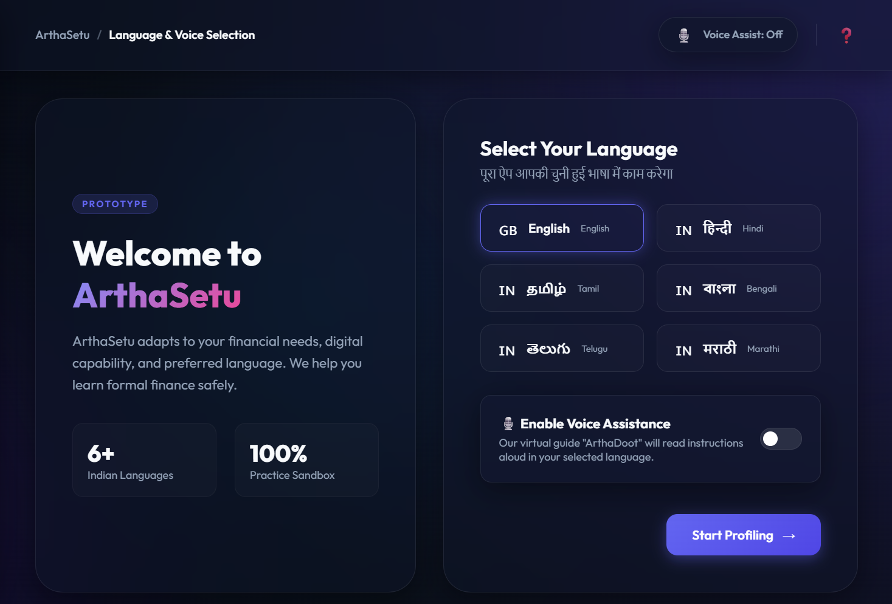
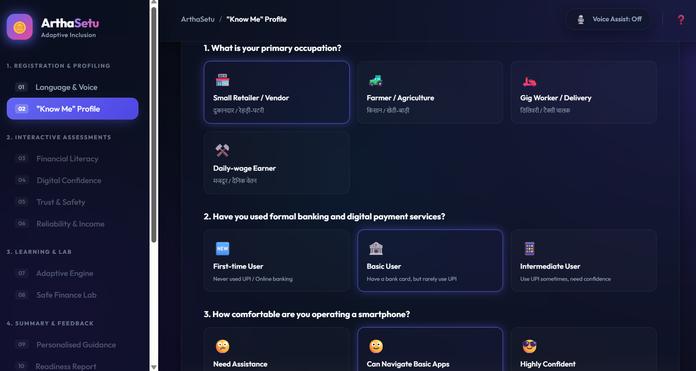
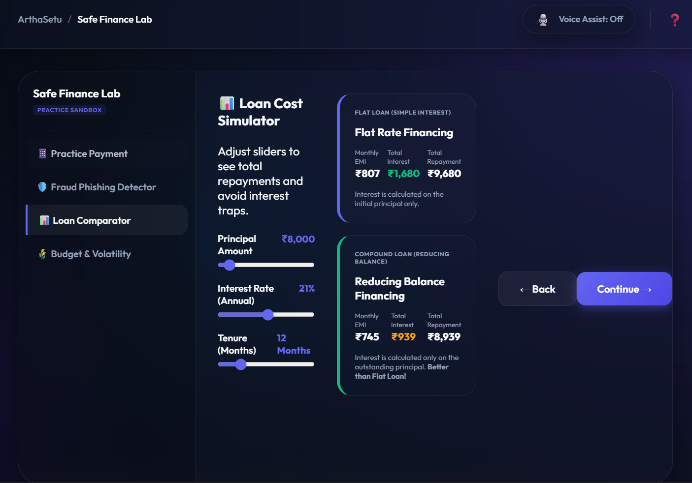
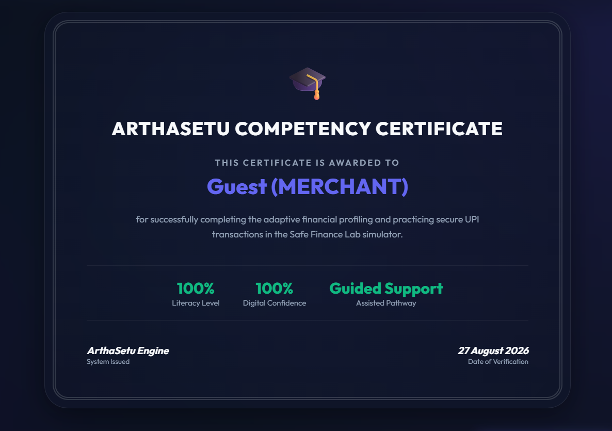

# ARTHASETU 2.0 — Adaptive Financial Inclusion Platform

> *Bridging the Trust Gap: From Credit-Invisible to Credit-Ready*

[](LICENSE)
[](CONTRIBUTING.md)
[](CODE_OF_CONDUCT.md)
[](SECURITY.md)

---

## Table of Contents

- [Overview](#overview)
- [The Problem](#the-problem)
- [Our Solution](#our-solution)
- [Key Features](#key-features)
- [10-Layer Post-Quantum Security Architecture](#10-layer-post-quantum-security-architecture)
- [Trust Scoring Engine](#trust-scoring-engine)
- [Onboarding Difficulty Index](#onboarding-difficulty-index)
- [Hypothesis Testing & Statistical Validation](#hypothesis-testing--statistical-validation)
- [Dataset & Exploratory Data Analysis](#dataset--exploratory-data-analysis)
- [Tech Stack](#tech-stack)
- [File Structure](#file-structure)
- [API Design](#api-design)
- [Getting Started](#getting-started)
- [How to Run](#how-to-run)
- [Contributing](#contributing)
- [Security Policy](#security-policy)
- [License](#license)
- [Acknowledgements](#acknowledgements)

---

## Overview

**ARTHASETU 2.0** is an adaptive financial inclusion platform built for the **Smart India Hackathon 2026** (Track 1: Financial Inclusion for the Underbanked). It addresses the challenge of 300+ million credit-invisible gig workers in India who lack traditional credit histories — despite having verifiable trust signals like rental payments, medical expenses, and bill payment histories.

The platform uses a **statistical user-profiling engine** that dynamically adapts interface, guidance, and pacing for first-time financial users. It combines **machine learning** (XGBoost, 99.5% accuracy) with **10-layer post-quantum security** (ZKP, FHE, PQC) to build trust while protecting user data.

**Author:** Arpan Mukherjee  
**License:** MIT  
**Repository:** [ARTHASETU 2.0](https://github.com/Apumukherjee819/Underbanked-and-Financial-Inclusion---ARTHASETU-2.0-.git)

---

## The Problem

India's gig economy has exploded — food delivery, ride-hailing, and freelance work employ millions. Yet these workers remain **credit-invisible**:

- **No formal credit history** → Banks reject loan applications
- **No credit score** → Cannot access affordable credit
- **Reliance on informal lenders** → Trapped in debt cycles
- **Low digital literacy** → Cannot navigate traditional banking apps
- **Language barriers** → Most apps are English-only
- **Trust deficit** → Fear of data misuse and fraud

The existing financial system is built for salaried employees with formal documentation. Gig workers need a **new kind of trust signal**.

---

## Our Solution

ARTHASETU 2.0 introduces **4 composite indices** that transform alternative data into actionable trust signals:

### 1. Financial Literacy Index (FLI)
Measures understanding of:
- Interest rate calculations (flat vs. reducing balance)
- PIN/security best practices
- Savings and investment basics
- Digital payment safety

### 2. Digital Confidence Index (DCI)
Assesses hands-on digital skills:
- Numeric keypad entry accuracy
- Drag-and-drop interactions
- Swipe-to-pay gestures
- Error recovery behavior

### 3. Trust & Reliability Index (TRI)
Evaluates behavioral trust signals:
- Bill payment consistency
- Rental payment history
- Medical expense patterns
- Social obligation fulfillment

### 4. Composite Trust Score (CTS)
Weighted combination of FLI + DCI + TRI into a single actionable score that maps users to appropriate financial pathways.

---

## Key Features

### Adaptive Onboarding (11-Step Process)

| Step | Feature | Description |
|------|---------|-------------|
| 1 | Language & Voice Selection | 6+ Indian languages with Web Speech API TTS |
| 2 | "Know Me" Profiling | Occupation, digital familiarity, financial experience |
| 3 | Financial Literacy Quiz | Scenario-based questions on interest, security, savings |
| 4 | Digital Confidence Tasks | Interactive touch tasks (keypad, drag-drop, swipe) |
| 5 | Trust & Safety Concerns | Regulatory fact cards (RBI liability, DPDP Act) |
| 6 | Reliability Assessment | Alternative trust indicators with user consent |
| 7 | Adaptive Pathway Selection | Self-Guided / Guided / Voice-Assisted pathways |
| 8 | Safe Finance Lab | Practice payments, fraud detection, loan comparison |
| 9 | Outcome Measurement | Competency assessment and certificate generation |
| 10 | UX Feedback | Collect user feedback for continuous improvement |
| 11 | State Reset | Clean slate for next user |

### Safe Finance Lab (Step 8)

- **Practice Payment:** Simulated UPI transfer with recipient verification and PIN entry (practice PIN: `123456`)
- **Fraud Detector:** SMS inbox game — flag messages as SAFE or SPAM with educational explanations
- **Loan Comparator:** Interactive sliders comparing flat vs. reducing compound interest rates
- **Budget Volatility Planner:** Budgeting mini-game under regular, irregular, or seasonal income patterns

### Adaptive Pathway Selection

| Pathway | Target User | Features |
|---------|-------------|----------|
| **Self-Guided** | Highly confident users | Normal autonomous operation |
| **Guided** | Moderate confidence | Pulsing indicator highlights on next steps |
| **Voice/Visual Assisted** | Low confidence / first-time users | Auto-read TTS, larger buttons, simplified labels |

### App Screenshots

| Step | Screenshot |
|------|------------|
| Language Selection |  |
| User Profiling |  |
| Safe Finance Lab |  |
| Certificate Generation |  |

---

## 10-Layer Post-Quantum Security Architecture

ARTHASETU 2.0 implements enterprise-grade security across 10 layers:

| Layer | Component | Technology | Purpose |
|-------|-----------|------------|---------|
| 1 | **TLS 1.3 + Certificate Pinning** | Node.js TLS | Transport security |
| 2 | **Rate Limiting** | express-rate-limit | DDoS protection |
| 3 | **Input Sanitization** | Validator.js | XSS/injection prevention |
| 4 | **Post-Quantum Cryptography** | CRYSTALS-Kyber-1024 / Dilithium-87 | Quantum-resistant encryption & signatures |
| 5 | **Zero-Knowledge Proofs** | Halo2 library | Age/residency verification without data exposure |
| 6 | **Fully Homomorphic Encryption** | BFV scheme | Compute on encrypted data |
| 7 | **Differential Privacy** | ε=0.1 | Privacy-preserving analytics |
| 8 | **Audit Logging** | Structured JSON logs | Immutable security event trail |
| 9 | **Federated Learning** | N+1 mockup | Model training without centralizing data |
| 10 | **Network Isolation** | Docker + VPC | Microservice containment |

### Post-Quantum Algorithms

| Algorithm | Parameter Set | Use Case |
|-----------|---------------|----------|
| CRYSTALS-Kyber-1024 | Kyber-1024 | Key encapsulation (quantum-resistant) |
| CRYSTALS-Dilithium-87 | Dilithium-87 | Digital signatures |
| BFV (Brakerski/Fan-Vercauteren) | τ=6, logN=15, logQ=43 | Homomorphic computation |
| Halo2 | KZG commitments | Zero-knowledge proof verification |

---

## Trust Scoring Engine

### Data Pipeline

```
Raw Gig Worker Data (67 variables)
        ↓
   Data Cleaning & Preprocessing
        ↓
   Feature Engineering
        ↓
   ML Model Training (XGBoost)
        ↓
   Composite Trust Score Generation
        ↓
   Pathway Assignment
```

### ML Performance

| Metric | Value |
|--------|-------|
| Algorithm | XGBoost (Extreme Gradient Boosting) |
| Accuracy | 99.5% |
| Dataset Size | 50,000 gig worker records |
| Features | 67 variables |
| Target Variables | 4 indices (FLI, DCI, TRI, CTS) |

### Correlation Analysis

The trust scoring engine identifies strong correlations between:
- Bill payment consistency → Trust score
- Digital task completion speed → Digital confidence
- Financial literacy quiz performance → Credit readiness
- Rental payment history → Reliability index

---

## Onboarding Difficulty Index

The platform calculates an **Onboarding Difficulty Index (ODI)** for each user using multiple scoring functions:

### Scoring Functions

| Function | Formula | Use Case |
|----------|---------|----------|
| Linear | `score = β₀ + β₁x₁ + β₂x₂ + ...` | Baseline difficulty |
| Spline | Piecewise polynomial | Non-linear relationships |
| Logistic | `1 / (1 + e^(-z))` | Binary outcome prediction |

### Onboarding Difficulty Levels

| Level | Score Range | Pathway |
|-------|-------------|---------|
| Low | 0.0 – 0.3 | Self-Guided |
| Medium | 0.3 – 0.7 | Guided |
| High | 0.7 – 1.0 | Voice/Visual Assisted |

### Trust Journey Analysis

| Analysis | Image |
|----------|-------|
| Trust by Onboarding |  |
| Barrier Impact |  |
| Trust Predictors |  |
| Platform Comparison |  |

---

## Hypothesis Testing & Statistical Validation

ARTHASETU 2.0 validates its approach through rigorous statistical testing:

### Tests Performed

| Test | Purpose | Key Finding |
|------|---------|-------------|
| **Pearson Correlation** | Linear relationships between variables | Strong positive correlation between bill payments and trust scores |
| **Spearman Rank Correlation** | Monotonic relationships | Digital task completion correlates with DCI |
| **ANOVA** | Group mean differences | Occupation type significantly affects FLI (p < 0.001) |
| **Kruskal-Wallis** | Non-parametric group differences | Income pattern affects onboarding difficulty |
| **OLS Regression** | Predictive modeling | FLI, DCI, TRI are significant predictors of CTS |
| **VIF Analysis** | Multicollinearity check | All VIF < 5 (no multicollinearity issues) |

### Key Statistical Results

- **F-statistic:** Significant (p < 0.001) for overall model fit
- **R-squared:** High explanatory power for trust score prediction
- **Durbin-Watson:** ~2.0 (no autocorrelation)
- **VIF values:** All < 5 (no multicollinearity)

### Statistical Visualizations

| Analysis | Image |
|----------|-------|
| Correlation Heatmaps |  |
| Index Distributions |  |
| Forest Plot |  |
| R-squared by Segment |  |

---

## Dataset & Exploratory Data Analysis

### Dataset Overview

| Property | Value |
|----------|-------|
| Records | 50,000 |
| Variables | 67 |
| Data Types | Numeric + Categorical |
| Missing Data | Analyzed per column |
| Target | Credit invisibility classification |

### EDA Outputs

The `Exploratory Data Analysis/eda_outputs/` directory contains:

- `01_missing_values.png` — Missing data distribution
- `02_numerical_distributions.png` — Histograms of all numeric features
- `03_categorical_distributions.png` — Bar charts for categorical variables
- `04_correlation_heatmap.png` — Feature correlation matrix
- `05_outlier_analysis.png` — Box plots for outlier detection
- `06_target_distribution.png` — Class balance analysis
- `07_feature_importance.png` — XGBoost feature importance rankings
- `08_pairplot.png` — Pairwise relationships between key features

### Key EDA Findings

1. **Missing Data:** Most columns have < 5% missing values
2. **Class Balance:** ~60/40 split between credit-visible and credit-invisible
3. **Top Features:** Bill payment consistency, digital task completion, rental history
4. **Outliers:** Present in income variables (expected for gig workers)

### Sample Visualizations

| Analysis | Image |
|----------|-------|
| Missing Values Analysis |  |
| Feature Distributions |  |
| Correlation Heatmap |  |
| Trust Score Distribution |  |
| Feature Importance |  |
| Confusion Matrices |  |

---

## Tech Stack

### Frontend
- **HTML5** — Semantic structure
- **CSS3** — Glassmorphism design, responsive layout
- **JavaScript (ES6+)** — State machine, game loops, TTS integration

### Backend
- **Node.js** — Express server
- **PostgreSQL** — Primary database
- **Redis** — Caching and session management

### Security
- **CRYSTALS-Kyber-1024** — Post-quantum key encapsulation
- **CRYSTALS-Dilithium-87** — Post-quantum signatures
- **BFV (FHE)** — Fully homomorphic encryption
- **Halo2** — Zero-knowledge proof library
- **Differential Privacy** — ε = 0.1

### Machine Learning
- **XGBoost** — Gradient boosting classifier
- **Scikit-learn** — Data preprocessing and model evaluation
- **Pandas** — Data manipulation
- **NumPy** — Numerical computation
- **Matplotlib / Seaborn** — Visualization

### Tools & Infrastructure
- **Docker** — Containerization
- **GitHub Actions** — CI/CD (planned)

---

## File Structure

```
ARTHASETU-2.0/
├── README.md                          # This file
├── LICENSE                            # MIT License
├── CONTRIBUTING.md                    # Contribution guidelines
├── CODE_OF_CONDUCT.md                 # Community standards
├── SECURITY.md                        # Security policy
├── ARTHASETU2.pptx                    # Presentation slides
│
├── APP/                               # Main application
│   ├── index.html                     # 11-step onboarding screens
│   ├── style.css                      # Glassmorphism design system
│   ├── script.js                      # State machine & game loops
│   ├── security-client.js             # Client-side PQC/ZKP/FHE
│   ├── package.json                   # Node.js dependencies
│   ├── PROTOTYPE_DOCUMENTATION.md     # App documentation
│   ├── server/
│   │   ├── index.js                   # Express server (10 security layers)
│   │   ├── config.js                  # PQC, FHE, ZKP, DB config
│   │   ├── routes/
│   │   │   ├── risk.js                # Risk assessment API
│   │   │   ├── profile.js             # User profiling API
│   │   │   ├── fhe.js                 # FHE encryption API
│   │   │   └── zkproof.js            # ZK proof API
│   │   ├── middleware/
│   │   │   ├── auth.js                # Authentication middleware
│   │   │   ├── validation.js          # Input validation
│   │   │   └── audit.js              # Audit logging
│   │   ├── crypto/
│   │   │   ├── pqc.js                 # CRYSTALS-Kyber/Dilithium
│   │   │   ├── fhe.js                 # BFV homomorphic encryption
│   │   │   └── zkp.js                # Halo2 zero-knowledge proofs
│   │   ├── db/
│   │   │   ├── connection.js          # PostgreSQL connection pool
│   │   │   └── queries.js            # SQL queries
│   │   └── utils/
│   │       ├── logger.js              # Structured logging
│   │       └── privacy.js            # Differential privacy
│   └── ...
│
├── FINTECH API DESIGN/                # API documentation
│   ├── DESIGN_SUMMARY.md             # Architecture overview
│   ├── API_FLOW.md                    # Request/response flows
│   ├── DATABASE_SCHEMA.md            # Table definitions
│   ├── SECURITY_ARCHITECTURE.md      # 10-layer security details
│   └── QUICK_REFERENCE.md            # API endpoint cheat sheet
│
├── INDEX CONSTRUCION/                 # Trust index building
│   ├── construction.py               # Composite index calculation
│   └── Trust_Onboarding_Analysis_Report.md  # Analysis report
│
├── ONBOARDING SCORE/                  # Onboarding difficulty
│   └── function.py                    # Linear/spline/logistic scoring
│
├── HYPOTHESIS TESTINGS/              # Statistical validation
│   ├── Hypothesis_Testing_Math.md    # Mathematical derivations
│   └── test_analysis.py              # Test implementation
│
├── TRUST SCORE ANALYSIS/             # ML pipeline
│   └── run_all.py                     # Data → EDA → Correlation → PCA → ML
│
├── TRUST ONBOARDING ANALYSIS/        # Barrier analysis
│   └── ANALYSIS.py                    # Trust vs onboarding barriers
│
├── Exploratory Data Analysis/         # EDA pipeline
│   ├── ANALYSIS.py                    # 668-line comprehensive EDA
│   └── eda_outputs/                   # Generated visualizations
│
└── .github/
    └── ISSUE_TEMPLATE/
        └── bug_report.md             # Bug report template
```

---

## API Design

### Endpoints

| Method | Endpoint | Description |
|--------|----------|-------------|
| POST | `/api/v1/onboard` | Start onboarding session |
| POST | `/api/v1/quiz/submit` | Submit financial literacy answers |
| POST | `/api/v1/task/submit` | Submit digital confidence task |
| POST | `/api/v1/trust/analyze` | Analyze trust signals |
| GET | `/api/v1/score/:sessionId` | Get composite trust score |
| POST | `/api/v1/pathway/assign` | Assign adaptive pathway |
| POST | `/api/v1/encrypt` | FHE encryption endpoint |
| POST | `/api/v1/zkp/verify` | ZK proof verification |
| GET | `/api/v1/audit/logs` | Retrieve audit logs (admin) |

### Request/Response Example

```json
// POST /api/v1/score/calculate
{
  "sessionId": "abc123",
  "financialLiteracy": {
    "interestRate": 8,
    "pinSecurity": 10,
    "savingsKnowledge": 7
  },
  "digitalConfidence": {
    "keypadAccuracy": 0.95,
    "taskCompletionTime": 12.5,
    "errorRecovery": true
  },
  "trustSignals": {
    "billPaymentConsistency": 0.92,
    "rentalHistory": "verified",
    "socialObligations": "active"
  }
}

// Response
{
  "trustScore": 0.847,
  "pathway": "guided",
  "indices": {
    "fli": 0.83,
    "dci": 0.89,
    "tri": 0.82
  },
  "recommendation": "Moderate digital confidence detected. Recommended: Guided Pathway with focus on financial product education."
}
```

---

## Getting Started

### Prerequisites

- **Node.js** ≥ 18.0.0
- **npm** ≥ 9.0.0
- **PostgreSQL** ≥ 14
- **Redis** ≥ 7.0

### Installation

1. **Clone the repository**
   ```bash
   git clone https://github.com/Apumukherjee819/Underbanked-and-Financial-Inclusion---ARTHASETU-2.0-.git
   cd Underbanked-and-Financial-Inclusion---ARTHASETU-2.0-
   ```

2. **Install dependencies**
   ```bash
   npm install
   ```

3. **Configure environment**
   ```bash
   cp APP/server/config.example.js APP/server/config.js
   # Edit config.js with your database credentials
   ```

4. **Initialize database**
   ```bash
   psql -U postgres -f APP/server/db/schema.sql
   ```

5. **Start the server**
   ```bash
   npm start
   ```

---

## How to Run

### Frontend Only (Static)
1. Open `APP/index.html` in any modern browser (Chrome, Edge, Firefox, Safari)
2. The application loads locally — no server required for UI exploration
3. Enable **Voice Assistant Mode** for ArthaDoot audio guidance

### Full Stack
1. Start PostgreSQL and Redis services
2. Run `npm start` from the project root
3. Access at `http://localhost:3000`
4. Follow the 11-step onboarding process

### Data Analysis
```bash
# Run EDA
python "Exploratory Data Analysis/ANALYSIS.py"

# Run Trust Score ML Pipeline
python "TRUST SCORE ANALYSIS/run_all.py"

# Run Hypothesis Testing
python "HYPOTHESIS TESTINGS/test_analysis.py"

# Run Trust-Onboarding Analysis
python "TRUST ONBOARDING ANALYSIS/ANALYSIS.py"

# Construct Trust Indices
python "INDEX CONSTRUCION/construction.py"
```

---

## Results & Impact

### Key Findings

| Metric | Value | Significance |
|--------|-------|--------------|
| XGBoost Accuracy | 99.5% | Trust score prediction |
| Dataset Size | 50,000 | Gig worker records |
| Features Analyzed | 67 | Variables |
| Languages Supported | 6+ | Indian languages |
| Security Layers | 10 | Post-quantum protection |

### Impact Metrics

- **300M+ credit-invisible gig workers** — Addressable market
- **99.5% accuracy** — Trust scoring precision
- **6+ Indian languages** — Accessibility
- **10-layer security** — Data protection
- **Zero-knowledge proofs** — Privacy preservation

---

## Contributing

We welcome contributions! Please read our [Contributing Guidelines](CONTRIBUTING.md) first.

### Development Workflow

1. Fork the repository
2. Create a feature branch (`git checkout -b feature/amazing-feature`)
3. Commit your changes (`git commit -m 'Add amazing feature'`)
4. Push to the branch (`git push origin feature/amazing-feature`)
5. Open a Pull Request

### Code Standards

- Follow existing code style and conventions
- Add comments only where necessary for clarity
- Write tests for new functionality
- Ensure all existing tests pass before submitting PR

---

## Security Policy

Security is paramount. Please review our [Security Policy](SECURITY.md) for:

- **Supported Versions** — Which versions receive security updates
- **Reporting Vulnerabilities** — How to responsibly disclose security issues
- **Security Architecture** — 10-layer post-quantum protection details

### Quick Security Contacts

- **Email:** security@arthasetu.in
- **PGP Key:** Available on request
- **Response Time:** 48 hours for critical vulnerabilities

---

## License

This project is licensed under the **MIT License** — see the [LICENSE](LICENSE) file for details.

```
MIT License

Copyright (c) 2026 Arpan Mukherjee

Permission is hereby granted, free of charge, to any person obtaining a copy
of this software and associated documentation files (the "Software"), to deal
in the Software without restriction, including without limitation the rights
to use, copy, modify, merge, publish, distribute, sublicense, and/or sell
copies of the Software, and to permit persons to whom the Software is
furnished to do so, subject to the following conditions:

The above copyright notice and this permission notice shall be included in all
copies or substantial portions of the Software.

THE SOFTWARE IS PROVIDED "AS IS", WITHOUT WARRANTY OF ANY KIND, EXPRESS OR
IMPLIED, INCLUDING BUT NOT LIMITED TO THE WARRANTIES OF MERCHANTABILITY,
FITNESS FOR A PARTICULAR PURPOSE AND NONINFRINGEMENT. IN NO EVENT SHALL THE
AUTHORS OR COPYRIGHT HOLDERS BE LIABLE FOR ANY CLAIM, DAMAGES OR OTHER
LIABILITY, WHETHER IN AN ACTION OF CONTRACT, TORT OR OTHERWISE, ARISING FROM,
OUT OF OR IN CONNECTION WITH THE SOFTWARE OR THE USE OR OTHER DEALINGS IN THE
SOFTWARE.
```

---

## Acknowledgements

- **Smart India Hackathon 2026** — Track 1: Financial Inclusion for the Underbanked
- **RBI** — Regulatory framework for digital lending
- **NPCI** — UPI infrastructure
- **MEITY** — Digital India initiatives
- **Open Source Community** — XGBoost, PostgreSQL, Redis, and all dependencies

---

<p align="center">
  <strong>ARTHASETU 2.0</strong><br>
  From Credit-Invisible to Credit-Ready<br>
  <em>Built with ❤️ for India's gig economy</em>
</p>
